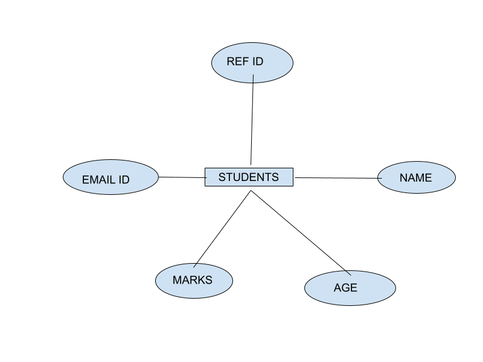
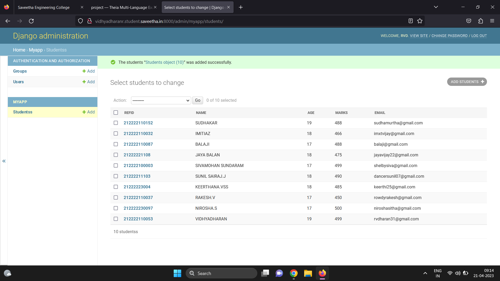

# Ex02 Django ORM Web Application

## AIM
To develop a Django application to store and retrieve data from a student database using Object Relational Mapping(ORM).

## Entity Relationship Diagram 



## DESIGN STEPS

### STEP 1:
Clone the repository in GitHub
Change directory to the name of the repository cloned.
$ cd repo
### STEP 2:
Change directory to the sub-folder
### STEP 3:
$ python3 manage.py startapp myapp
### STEP 4:
Click on settings.py and insert “import os”. Then insert ‘myapp’ in the configuration INSTALLED_APPS
### Step 5:
 Check whether Django server is installed successfully
$ python3 manage.py runserver 0:8000
Go to the URL ‘http://user.student.saveetha.in:8000/’

### Step 6: 
 Inform Git that you want to include updates to a particular file in the next commit. 
$ git add -A

### Step 7: 
Configure GitHub username
$ git config user.name "user"

### Step 8: 
Configure GitHub email
$ git config user.email "user@gmail.com"

### Step 9: 
Commit all the updates
$ git commit -m "Success"


## PROGRAM
```
admin.py

from django.contrib import admin
from .models import Students,StudentsAdmin
admin.site.register(Students,StudentsAdmin)

models.py

from django.db import models
from django.contrib import admin
class Students (models.Model):
    Refid=models.CharField(max_length=20,help_text="student Id")
    Name=models.CharField(max_length=100)
    Age=models.IntegerField()
    Marks=models.IntegerField()
    Email=models.EmailField()
class StudentsAdmin(admin.ModelAdmin):
    list_display=('Refid','Name','Age','Marks','Email')
```

## OUTPUT



## RESULT
The program for student database using ORM is executted successfully.